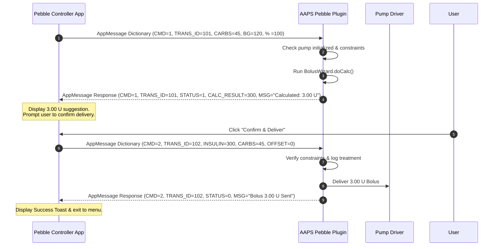

# Pebble App Developer Protocol & Interface Specification

## 1. Executive Summary

This document specifies the exact communication protocol, dictionary keys, data types, unit scaling, timings, sequence flows, and error handling rules required to build a Pebble watch application (Watchface or Controller App) that integrates bi-directionally with AndroidAPS (AAPS).

---

## 2. Architecture & Twin-UUID Scheme

To preserve watchface battery life and memory while enabling secure, fast bi-directional command controls, AAPS uses a **Twin-UUID Routing Scheme**:

| App / Channel | Preference Key | Default UUID | Direction | Purpose |
| :--- | :--- | :--- | :--- | :--- |
| **Watchface Telemetry** | `pebble_app_uuid` | `54D3008F-E144-4712-B201-24BC515C40BA` | AAPS $\rightarrow$ Watch (Passive) | Continuous BG, IOB, COB, Basal, and 36-point history graph updates. |
| **Controller App** | `pebble_controller_uuid` | `A1B2C3D4-E5F6-7A8B-9C0D-1E2F3A4B5C6D` | Watch $\leftrightarrow$ AAPS (Bi-directional) | Bolus calculation, bolus confirmation/delivery, temp targets, alarm mute, stop bolus, eCarbs. |

> [!IMPORTANT]
> The Pebble C app developer must configure the App UUID in `appinfo.json` to match the target channel (`pebble_app_uuid` for watchface UI, or `pebble_controller_uuid` for the command controller UI).

---

## 3. Protocol Dictionary & Key Definitions

### 3.1 Passive Telemetry Keys (Watchface Channel: `pebble_app_uuid`)

| Key Constant | ID | Type | Description / Example |
| :--- | :---: | :--- | :--- |
| `KEY_BG` | `0` | `String` | Current BG string (e.g. `"118"` or `"6.5"`) |
| `KEY_TIME` | `1` | `Int32` | Last BG reading timestamp (Unix epoch ms) |
| `KEY_IOB` | `2` | `String` | Total IOB string (e.g. `"2.45 U"`) |
| `KEY_COB` | `3` | `String` | Total COB string (e.g. `"35g"`) |
| `KEY_DELTA` | `4` | `String` | 5-min BG delta string (e.g. `"+4"` or `"-0.2"`) |
| `KEY_TREND` | `5` | `Int32` | TrendArrow enum ordinal (0=NONE, 1=DOUBLE_DOWN, 4=FLAT, 7=DOUBLE_UP, etc.) |
| `KEY_UNITS` | `6` | `Int32` | User glucose units (`0` = mg/dL, `1` = mmol/L) |
| `KEY_AVG_DELTA` | `7` | `String` | Short avg delta string (e.g. `"+2"` or `"+0.1"`) |
| `KEY_BASAL` | `8` | `String` | Current active basal rate string (e.g. `"0.85"`) |
| `KEY_IOB_DETAIL` | `9` | `String` | Detailed IOB breakdown string `"(BolusIOB|BasalIOB)"` (e.g. `"(1.50|0.95)"`) |
| `KEY_BG_HISTORY` | `10` | `Byte[]` | 36-byte array of right-aligned scaled BG values (`reading.value / 2`) |
| `KEY_LOW_LINE` | `11` | `Int32` | Target low mark threshold in mg/dL (e.g. `70`) |
| `KEY_HIGH_LINE` | `12` | `Int32` | Target high mark threshold in mg/dL (e.g. `180`) |

---

### 3.2 Command Protocol Keys (Controller Channel: `pebble_controller_uuid`)

| Key Constant | ID | Type | Scaling / Format | Direction | Description |
| :--- | :---: | :---: | :--- | :---: | :--- |
| `KEY_CMD_TYPE` | `20` | `Int32` | `1`..`7` | Watch $\rightarrow$ AAPS & Echo | Command type code (see Section 4) |
| `KEY_TRANS_ID` | `21` | `Int32` | Integer ID | Watch $\rightarrow$ AAPS & Echo | Monotonic transaction ID for request/response matching |
| `KEY_CARBS` | `22` | `Int32` | Grams | Watch $\leftrightarrow$ AAPS | Carbs in grams |
| `KEY_BG` | `23` | `Int32` | Glucose | Watch $\rightarrow$ AAPS | User BG entry (mg/dL or mmol/L * 10) |
| `KEY_INSULIN_AMOUNT` | `24` | `Int32` | Units * 100 | Watch $\leftrightarrow$ AAPS | Insulin amount (`1.50 U` $\rightarrow$ `150`) |
| `KEY_DURATION` | `25` | `Int32` | Minutes / Hours | Watch $\rightarrow$ AAPS | Temp target duration (mins) or eCarbs duration (hrs) |
| `KEY_TEMP_TARGET_BG` | `26` | `Int32` | Glucose | Watch $\rightarrow$ AAPS | Temp target BG value (mg/dL or mmol/L * 10) |
| `KEY_STATUS_CODE` | `27` | `Int32` | Code `0`,`1`,`2` | AAPS $\rightarrow$ Watch | Response status: `0`=SUCCESS, `1`=PENDING_CONFIRMATION, `2`=ERROR |
| `KEY_CALC_RESULT` | `28` | `Int32` | Units * 100 | AAPS $\rightarrow$ Watch | Bolus Wizard calculated total insulin suggestion |
| `KEY_MESSAGE` | `29` | `String` | Text string | AAPS $\rightarrow$ Watch | Status or error message string for user display |
| `KEY_PERCENTAGE` | `30` | `Int32` | `1`..`500` | Watch $\rightarrow$ AAPS | Bolus dose percentage adjustment (default: `100`) |
| `KEY_CARB_TIME_OFFSET` | `31` | `Int32` | Minutes | Watch $\rightarrow$ AAPS | Carb delay offset in minutes (e.g. `-10`, `0`, `15`) |
| `KEY_PRESET_TYPE` | `32` | `Int32` | Code `0`..`4` | Watch $\rightarrow$ AAPS | TT Preset type (`0`=MANUAL, `1`=EATING_SOON, `2`=ACTIVITY, `3`=HYPO, `4`=CANCEL) |

---

## 4. Command Codes & Payload Specifications

### Command `1`: `CALCULATE_BOLUS` (Bolus Wizard Calculation)
- **Watch Request Payload**:
  - `KEY_CMD_TYPE` (20) = `1`
  - `KEY_TRANS_ID` (21) = `<trans_id>`
  - `KEY_CARBS` (22) = Carbs in grams (e.g. `30`)
  - `KEY_BG` (23) = (Optional) Glucose entry. If `mmol/L`, send value * 10 or raw integer < 35 (e.g. `6.5` $\rightarrow$ `6` or `65`).
  - `KEY_PERCENTAGE` (30) = (Optional) Dose percentage scaling (default `100`).
- **AAPS Response Payload**:
  - `KEY_CMD_TYPE` (20) = `1`
  - `KEY_TRANS_ID` (21) = `<trans_id>`
  - `KEY_STATUS_CODE` (27) = `1` (`PENDING_CONFIRMATION`)
  - `KEY_CALC_RESULT` (28) = Calculated total insulin scaled * 100 (e.g. `1.50 U` $\rightarrow$ `150`)
  - `KEY_MESSAGE` (29) = `"Calculated: 1.50 U"`

---

### Command `2`: `CONFIRM_AND_DELIVER_BOLUS` (Bolus Execution)
- **Watch Request Payload**:
  - `KEY_CMD_TYPE` (20) = `2`
  - `KEY_TRANS_ID` (21) = `<trans_id>`
  - `KEY_INSULIN_AMOUNT` (24) = Insulin amount scaled * 100 (e.g. `1.50 U` $\rightarrow$ `150`)
  - `KEY_CARBS` (22) = Carbs in grams (e.g. `30`)
  - `KEY_CARB_TIME_OFFSET` (31) = (Optional) Carb delay offset in minutes (e.g. `0` or `15`)
- **AAPS Response Payload**:
  - `KEY_CMD_TYPE` (20) = `2`
  - `KEY_TRANS_ID` (21) = `<trans_id>`
  - `KEY_STATUS_CODE` (27) = `0` (`SUCCESS`) or `2` (`ERROR`)
  - `KEY_MESSAGE` (29) = `"Bolus 1.50 U Sent"` (or error text if pump unavailable/constrained)

---

### Command `3`: `SET_TEMP_TARGET` (Temp Target Creation)
- **Watch Request Payload**:
  - `KEY_CMD_TYPE` (20) = `3`
  - `KEY_TRANS_ID` (21) = `<trans_id>`
  - `KEY_PRESET_TYPE` (32) = Preset enum:
    - `0` = MANUAL (requires `KEY_DURATION` (25) and `KEY_TEMP_TARGET_BG` (26))
    - `1` = EATING_SOON (uses AAPS Overview Eating Soon preferences)
    - `2` = ACTIVITY (uses AAPS Overview Activity preferences)
    - `3` = HYPO (uses AAPS Overview Hypo preferences)
    - `4` = CANCEL (cancels active temp target)
- **AAPS Response Payload**:
  - `KEY_CMD_TYPE` (20) = `3`
  - `KEY_TRANS_ID` (21) = `<trans_id>`
  - `KEY_STATUS_CODE` (27) = `0` (`SUCCESS`)
  - `KEY_MESSAGE` (29) = `"Temp Target Set"` or `"Temp Target Cancelled"`

---

### Command `4`: `CANCEL_ACTIVE_TEMP_TARGET` (Cancel Active Temp Target)
- **Watch Request Payload**:
  - `KEY_CMD_TYPE` (20) = `4`
  - `KEY_TRANS_ID` (21) = `<trans_id>`
- **AAPS Response Payload**:
  - `KEY_CMD_TYPE` (20) = `4`
  - `KEY_TRANS_ID` (21) = `<trans_id>`
  - `KEY_STATUS_CODE` (27) = `0` (`SUCCESS`)
  - `KEY_MESSAGE` (29) = `"Temp Target Cancelled"`

---

### Command `5`: `SNOOZE_ALARM` (Mute Active Phone Alarm)
- **Watch Request Payload**:
  - `KEY_CMD_TYPE` (20) = `5`
  - `KEY_TRANS_ID` (21) = `<trans_id>`
- **AAPS Response Payload**:
  - `KEY_CMD_TYPE` (20) = `5`
  - `KEY_TRANS_ID` (21) = `<trans_id>`
  - `KEY_STATUS_CODE` (27) = `0` (`SUCCESS`)
  - `KEY_MESSAGE` (29) = `"Alarm Muted"`

---

### Command `6`: `CANCEL_ACTIVE_BOLUS` (Emergency Stop Active Bolus)
- **Watch Request Payload**:
  - `KEY_CMD_TYPE` (20) = `6`
  - `KEY_TRANS_ID` (21) = `<trans_id>`
- **AAPS Response Payload**:
  - `KEY_CMD_TYPE` (20) = `6`
  - `KEY_TRANS_ID` (21) = `<trans_id>`
  - `KEY_STATUS_CODE` (27) = `0` (`SUCCESS`)
  - `KEY_MESSAGE` (29) = `"Bolus Stopped"`

---

### Command `7`: `SET_ECARBS` (Extended Carbs Entry)
- **Watch Request Payload**:
  - `KEY_CMD_TYPE` (20) = `7`
  - `KEY_TRANS_ID` (21) = `<trans_id>`
  - `KEY_CARBS` (22) = Carbs in grams
  - `KEY_DURATION` (25) = Duration in hours (e.g. `3`)
  - `KEY_CARB_TIME_OFFSET` (31) = Delay offset in minutes (default `0`)
- **AAPS Response Payload**:
  - `KEY_CMD_TYPE` (20) = `7`
  - `KEY_TRANS_ID` (21) = `<trans_id>`
  - `KEY_STATUS_CODE` (27) = `0` (`SUCCESS`)
  - `KEY_MESSAGE` (29) = `"eCarbs Logged"`

---

## 5. Sequence Flows

### 5.1 Bolus Wizard Workflow Sequence



---

## 6. Pebble C SDK Implementation Guidelines

### 6.1 AppMessage Buffer Configuration

In the Pebble C app `main()` initialization, allocate sufficient AppMessage inbox/outbox buffers:

```c
#define APPMESSAGE_INBOX_SIZE  256
#define APPMESSAGE_OUTBOX_SIZE 256

static void init(void) {
    // Register AppMessage handlers
    app_message_register_inbox_received(inbox_received_callback);
    app_message_register_inbox_dropped(inbox_dropped_callback);
    app_message_register_outbox_failed(outbox_failed_callback);
    app_message_register_outbox_sent(outbox_sent_callback);
    
    // Open AppMessage channel
    app_message_open(APPMESSAGE_INBOX_SIZE, APPMESSAGE_OUTBOX_SIZE);
}
```

### 6.2 Sending a Command Example (`CONFIRM_AND_DELIVER_BOLUS`)

```c
#include <pebble.h>

#define KEY_CMD_TYPE          20
#define KEY_TRANS_ID          21
#define KEY_CARBS             22
#define KEY_INSULIN_AMOUNT    24
#define KEY_CARB_TIME_OFFSET  31

static int s_trans_id_counter = 100;

void send_confirm_bolus(int carbs_g, int insulin_u_x100, int offset_mins) {
    DictionaryIterator *iter;
    AppMessageResult res = app_message_outbox_begin(&iter);
    if (res != APP_MSG_OK) {
        APP_LOG(APP_LOG_LEVEL_ERROR, "Outbox begin failed: %d", res);
        return;
    }

    int trans_id = ++s_trans_id_counter;

    dict_write_int32(iter, KEY_CMD_TYPE, 2); // CONFIRM_AND_DELIVER_BOLUS
    dict_write_int32(iter, KEY_TRANS_ID, trans_id);
    dict_write_int32(iter, KEY_CARBS, carbs_g);
    dict_write_int32(iter, KEY_INSULIN_AMOUNT, insulin_u_x100);
    dict_write_int32(iter, KEY_CARB_TIME_OFFSET, offset_mins);

    app_message_outbox_send();
}
```

### 6.3 Processing Inbox Responses Example

```c
#define KEY_STATUS_CODE 27
#define KEY_CALC_RESULT 28
#define KEY_MESSAGE     29

static void inbox_received_callback(DictionaryIterator *iterator, void *context) {
    Tuple *cmd_tuple = dict_find(iterator, KEY_CMD_TYPE);
    Tuple *trans_tuple = dict_find(iterator, KEY_TRANS_ID);
    Tuple *status_tuple = dict_find(iterator, KEY_STATUS_CODE);
    Tuple *msg_tuple = dict_find(iterator, KEY_MESSAGE);

    if (!cmd_tuple || !status_tuple) {
        return;
    }

    int cmd_type = cmd_tuple->value->int32;
    int status_code = status_tuple->value->int32;
    const char *message = msg_tuple ? msg_tuple->value->cstring : "";

    if (status_code == 0) { // SUCCESS
        APP_LOG(APP_LOG_LEVEL_INFO, "Command %d Succeeded: %s", cmd_type, message);
        // Show success UI banner / vibrate
    } else if (status_code == 1) { // PENDING_CONFIRMATION (Wizard Result)
        Tuple *calc_tuple = dict_find(iterator, KEY_CALC_RESULT);
        int calc_insulin_x100 = calc_tuple ? calc_tuple->value->int32 : 0;
        // Update wizard prompt UI with calculated insulin amount
    } else if (status_code == 2) { // ERROR
        APP_LOG(APP_LOG_LEVEL_ERROR, "Command %d Failed: %s", cmd_type, message);
        // Display error dialog to user
    }
}
```

---

## 7. Timings, Timeouts & Error Handling Rules

1. **Response Timeout**: The watch app must start a 7-second timer upon calling `app_message_outbox_send()`. If no response with a matching `KEY_TRANS_ID` is received before timer expiry, cancel the pending action and present a `"Connection Timeout"` message to the user.
2. **Transaction ID Matching**: Always verify `KEY_TRANS_ID` on incoming responses matches the outbound `KEY_TRANS_ID` to prevent processing stale or out-of-order messages.
3. **Pebble Outbox Failure Handling**: If `outbox_failed_callback` triggers, immediately notify the user (`"Failed to reach phone"`) and allow retry.
4. **Vibration Feedback**:
   - `SUCCESS` (`STATUS_CODE == 0`): `vibes_short_pulse()`
   - `ERROR` (`STATUS_CODE == 2`): `vibes_double_pulse()`
