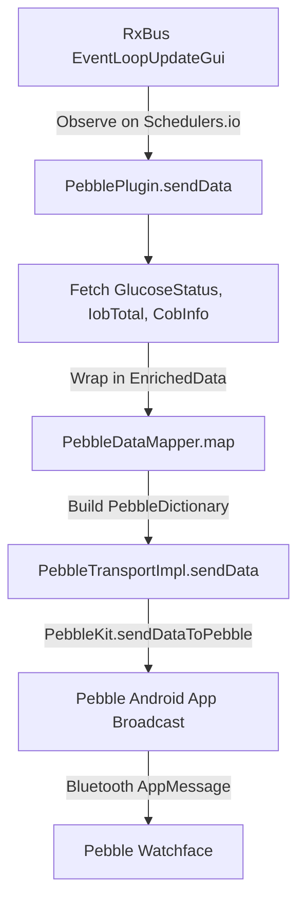

# AndroidAPS Pebble Plugin — Code Review Report

## Executive Summary
This report presents an in-depth code review of the new `plugins/pebble` module in AndroidAPS. The plugin was compared against the **Wear OS plugin** (`plugins/sync/wear`), the **Tizen/Garmin plugins**, and the **PebbleKit Android SDK documentation** (`sps/PebbleKit_Android_Docs_Depth3.md`).

**Verdict**: The modular architecture (separating transport, UI, mapping, and orchestration) is well-structured and compiled successfully, with all unit tests passing. However, **several critical logic bugs, protocol omissions, and UX issues** exist that will cause incorrect display, watchapp crashes, or configuration misalignment when sideloading a watchface. 

---

## 1. End-to-End Data Flow Analysis
The data flow of the Pebble plugin is uni-directional (Phone to Watch):


### Contrast with Wear OS / Tizen
- **Uni-directional vs. Bi-directional**: The Wear OS integration allows bi-directional commands (bolusing, temp target settings, quick wizards, profile switching) with validation handshakes and confirmation/error messages. The Pebble plugin currently only supports uni-directional data pushing.
- **Raw Data vs. Formatted Strings**: Wear OS sends pre-formatted display strings (`sgvString`, `delta`, units) alongside raw numerical values. This minimizes layout and parsing logic on the watch. The Pebble plugin sends raw numbers, shifting all string generation and decimal formatting to the Pebble's C/JS code.

---

## 2. Identified Bugs & Logic Errors

### 🔴 Critical Bug: Trend Arrow vs. Delta Value Confusion
In `PebblePlugin.kt` (lines 114–115):
```kotlin
val data = EnrichedData(
    bg = bgStatus?.glucose,
    trend = bgStatus?.delta?.toInt(), // BUG: This is the raw BG delta!
    ...
)
```
In `PebbleKeys.kt` and `PebbleDataMapper.kt`, key `1` (`PebbleKeys.TREND`) is loaded with this value.
- **The Issue**: `TREND` in watchfaces is typically mapped to a `TrendArrow` enum (0 to 9 representing direction arrows). By sending the raw delta (e.g., `+5` or `-12`), the watch face will receive values that are out-of-bounds.
- **The Risk**: In C watchapps, mapping out-of-bounds or negative values (like `-12` when glucose is falling) directly to graphics arrays causes **out-of-bounds memory access** and **watchapp crashes/device reboots**.
- **The Fix**: Retrieve the trend arrow index from the glucose value:
  ```kotlin
  trend = iobCobCalculator.ads.lastBg()?.trendArrow?.ordinal ?: TrendArrow.NONE.ordinal
  ```

### 🔴 Critical Bug: Glucose Unit Setting Ignored (mmol/L Bug)
In `PebbleDataMapper.kt` (line 17):
```kotlin
data.bg?.let { 
    dict.addInt32(PebbleKeys.BG, it.toInt()) // BUG: Always casts raw mg/dL double to Int
}
```
- **The Issue**: AAPS stores blood glucose values internally in `mg/dL`. For mmol/L users, a glucose value of `120.0 mg/dL` is returned. Casting it to an integer sends `120` to the watch.
- **The Risk**: The Pebble watch has no concept of the user's unit settings because no unit key is sent. It will display `120` even if the user is configured for `mmol/L` (where they expect `6.7`). This is a **severe safety hazard**.
- **The Fix**: Either send a units key so the watchface can convert it, or convert/scale the value on the phone before sending (e.g., sending `6.7` scaled by 10 as `67`, or as a formatted string).

### 🟡 Logic Error: Handler Registration Leak on UUID Change
In `PebblePlugin.kt`, ACK/NACK receivers are registered on start:
```kotlin
override fun onStart() {
    ...
    registerReceivers()
}
```
- **The Issue**: If the user opens `PebbleFragment`, enters a new UUID, and clicks **Save**, `TargetUuidProvider` updates the preferences. However, the active `BroadcastReceiver` handlers inside `PebblePlugin` remain registered to the **old UUID**.
- **The Risk**: The plugin will send new updates to the new UUID, but the ACK/NACK logs will listen to the old UUID, breaking transport diagnostics.
- **The Fix**: Implement a preference change listener to re-register receivers when the target UUID changes.

### 🟢 UX Omission: Missing String Trimming in settings
In `PebbleFragment.kt` (line 40), the input string is saved directly without trimming:
```kotlin
val uuidString = binding.pebbleUuid.text.toString()
```
- **The Issue**: Mobile copy-paste often appends trailing whitespaces. If a user pastes `"54D3008F-E144-4712-B201-24BC515C40BA "`, `UUID.fromString` throws an exception, showing an "Invalid UUID" error.
- **The Fix**: Call `.trim()` on the text value:
  ```kotlin
  val uuidString = binding.pebbleUuid.text.toString().trim()
  ```

---

## 3. Data & Feature Gaps

The current Pebble protocol is extremely barebones. To match the usability of Wear OS or Tizen, we should expand the Pebble Dictionary protocol to include loop metadata:

| Key Name | Code Key | Type | Description |
| :--- | :--- | :--- | :--- |
| **BG** | `0` | `Int32` | Raw glucose value (mg/dL) |
| **TREND** | `1` | `Int32` | Trend arrow enum ordinal (0–9) |
| **IOB** | `2` | `Int32` | Scaled insulin on board (IOB * 100) |
| **COB** | `3` | `Int32` | Scaled carbs on board (COB * 100) |
| **TIME** | `4` | `Int32` | Unix timestamp of data (seconds) |
| **BG_STRING** | `5` | `String` | Formatted glucose string (e.g., `"120"` or `"6.7"`) |
| **DELTA** | `6` | `Int32` | Scaled glucose delta (delta * 10 or 100) |
| **UNITS** | `7` | `Int32` | User glucose units (0 = mg/dL, 1 = mmol/L) |
| **BASAL** | `8` | `Int32` | Scaled active basal rate (U/hr * 100) |
| **BATTERY** | `9` | `Int32` | Phone battery level (0–100) |
| **LOOP_STATUS**| `10` | `Int32` | Loop status (0 = Green/OK, 1 = Yellow, 2 = Red/Error) |

---

## 4. Unit Test Assessment
Current unit tests cover `PebbleDataMapper`, `TargetUuidProvider`, and `PebblePlugin` lifecycle basics. However, there are significant coverage gaps:

1. **Watch Connectivity**: No test verifies that `sendData` aborts early and logs a warning if `transport.isWatchConnected(context)` is `false`.
2. **Null Values handling**: `PebblePluginTest` does not verify what happens if `bgStatus` or other loop data are null (e.g., during startup or database rebuild).
3. **Data Mapping accuracy**: The tests mock `mapper.map` during `PebblePluginTest`, meaning we don't test the integration between the plugin's data gathering and the actual mapper output.
4. **UUID Change logic**: There are no tests verifying behavior if the UUID is updated dynamically.

---

## 5. Recommended Code Fixes

### Fix 1: Protocol and Trend Arrow in `PebblePlugin.kt`
```kotlin
// In PebblePlugin.kt -> sendData()
val bgStatus = glucoseStatusProvider.getGlucoseStatusData()
val lastBg = iobCobCalculator.ads.lastBg()
val trendArrow = lastBg?.trendArrow ?: TrendArrow.NONE

val data = EnrichedData(
    bg = bgStatus?.glucose,
    trend = trendArrow.ordinal, // Correctly send trend arrow ordinal
    iob = iobTotal.iob,
    cob = cobInfo.displayCob ?: 0.0,
    time = System.currentTimeMillis()
)
```

### Fix 2: Supporting Units and Formatted BG in `PebbleDataMapper.kt`
Add keys to `PebbleKeys.kt`:
```kotlin
object PebbleKeys {
    const val BG = 0
    const val TREND = 1
    const val IOB = 2
    const val COB = 3
    const val TIME = 4
    const val BG_STRING = 5
    const val UNITS = 6
}
```
Update `PebbleDataMapper.kt` to serialize the unit information:
```kotlin
fun map(data: EnrichedData, units: GlucoseUnit, formattedBg: String): PebbleDictionary {
    val dict = PebbleDictionary()
    // ... maps existing keys ...
    dict.addString(PebbleKeys.BG_STRING, formattedBg)
    dict.addInt32(PebbleKeys.UNITS, if (units == GlucoseUnit.MGDL) 0 else 1)
    return dict
}
```

### Fix 3: Handle Preference Changes in `PebblePlugin.kt`
```kotlin
private val preferenceListener = SharedPreferences.OnSharedPreferenceChangeListener { _, key ->
    if (key == "pebble_app_uuid") {
        aapsLogger.info(LTag.PEBBLE, "PebblePlugin: Target UUID changed. Re-registering receivers.")
        unregisterReceivers()
        registerReceivers()
    }
}

override fun onStart() {
    super.onStart()
    PreferenceManager.getDefaultSharedPreferences(context)
        .registerOnSharedPreferenceChangeListener(preferenceListener)
    // ...
}

override fun onStop() {
    PreferenceManager.getDefaultSharedPreferences(context)
        .unregisterOnSharedPreferenceChangeListener(preferenceListener)
    // ...
}
```
